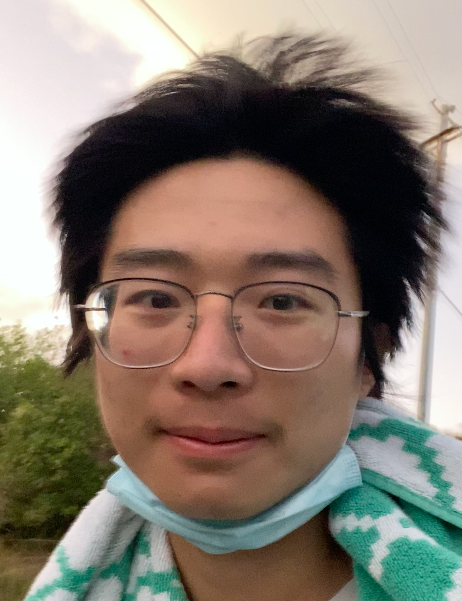

<!-- ## About Me -->

Hi! I am Xuanming Cui, a 2nd year Computer Science PhD student at University of Central Florida with Dr.Ser-nam Lim. My research interest is in knowledge representation, neuro-symbolic methods, reasoning, and multimodal content understanding.  
  
Email: xuanming.cui (at) ucf.edu

<!--  /  -->

## Publications 

(\* Equal Contr.)

- *Think Then Embed: Generative context improves multimodal embedding* **(ICLR 2026)**  
&nbsp;&nbsp; **Xuanming Cui**\*, Jianpeng Cheng*, Hong-you Chen, Satya Narayan Shukla, Abhijeet Awasthi, Xichen Pan, Chaitanya Ahuja, Shlok Kumar Mishra, Yonghuan Yang, Jun Xiao, Qi Guo, Ser-Nam Lim, Aashu Singh, Xiangjun Fan

- *Improving Soft Unification with Knowledge Graph Embedding Methods*  **(ICML 2025)**  
&nbsp;&nbsp; **Xuanming Cui**, Chionh Wei Peng, Adriel Kuek, Ser-Nam Lim  

- *AirSketch: Generative Motion to Sketch* **(NeurIPS 2024)**  
&nbsp;&nbsp; Hui Xian Grace Lim\*, **Xuanming Cui**\*, Ser-Nam Lim, Yogesh S Rawat  

- *On the robustness of large multimodal models against image adversarial attacks* **(CVPR 2024)**  
&nbsp;&nbsp; **Xuanming Cui**, Alejandro Aparcedo, Young Kyun Jang, Ser-Nam Lim  

## Experience

- Research Scientist Intern @ **Meta**  
&nbsp;&nbsp; May-Nov, 2025  
&nbsp;&nbsp; Multimodal Embedding

- Quantitative Modeler and Developer Intern @ **Pretium**  
&nbsp;&nbsp; May-Nov, 2021  
&nbsp;&nbsp; Mortgage Backed Securities
